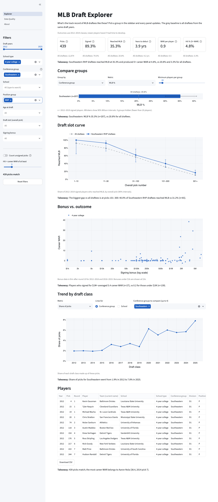
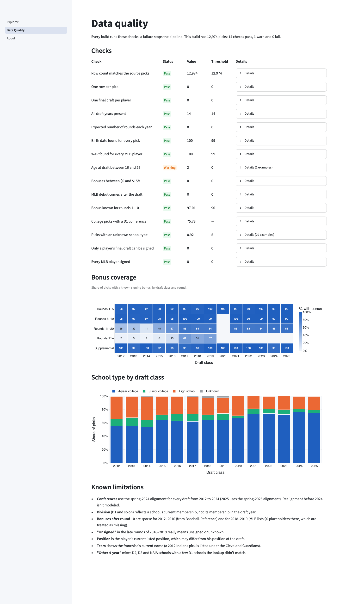
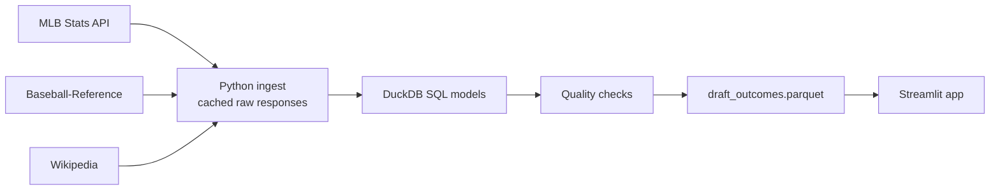

# MLB Draft Explorer

How have MLB draftees like this one turned out? A dashboard over every draft pick from 2012 to
2025, sliced by school, conference, school type, position, age, draft slot and signing bonus.

**[Open the live app](STREAMLIT_URL)**

[](https://github.com/mishareiss/mlb-draft-explorer/actions/workflows/ci.yml)



## Why this exists

Scouts and draft coordinators regularly need the answer to "what's the track record of players
like this?" That answer usually lives in an analyst's notebook. This app lets them get it
themselves: pick a group, and every panel compares it with all draftees from the same years.

## Three findings

Signed, outcome-eligible players from the 2012–2019 classes (reproduce with
`uv run python scripts/readme_findings.py`):

- **Draft slot dominates.** 92.1% of top-10 overall picks reached MLB (n=76), vs 10.5% of
  picks 301 and later (n=4,951).
- **The SEC outperforms.** SEC draftees reached MLB at 30.8% (n=542) vs 20.8% for all
  draftees, with double the WAR per player (1.0 vs 0.5).
- **High schoolers who sign get there more often, but slower.** Among signed players, high school draftees reached MLB more often than 4-year college players (28.2% vs 19.8%) and produced more WAR per player (0.9 vs 0.5), but took longer to debut (median 5.2 vs 4.0 years). About a third of drafted high schoolers don't sign and go to college instead.

## What you can do in the app

- Filter by draft years, school type, conference, school, position group, age, slot and bonus,
  and see MLB %, years to debut, WAR per player and hit rate against the all-draftee baseline.
- Rank conferences, schools, positions or bonus bands on any metric, with 90% intervals and
  a minimum sample size.
- Compare a group's MLB % by draft slot with all draftees', and see bonus vs career WAR per
  player.
- Track how a group's share of picks, median bonus or MLB % changed by draft class.
- Browse the matching players and download them as CSV. Every panel ends with a one-sentence
  takeaway.



## How it's built



- [`ingest/`](ingest/): pulls and caches the raw sources, backfills 2012–2016 bonuses from
  Baseball-Reference, and builds the school and conference reference in `reference/`.
- [`models/`](models/): staging and intermediate SQL run in DuckDB by `transform/run.py`,
  ending in one row per pick with outcomes.
- [`quality/`](quality/): checks that run on every build and write `quality_report.json`. Any
  failure stops the build.
- [`app/`](app/): the Streamlit Explorer, Data Quality and About pages. Metrics live in
  `app/lib/metrics.py`, separate from the UI, and are unit-tested.

## Data quality

Every build runs 15 checks. The committed build has 12,974 picks, and 14 checks pass with 1
warning (two picks with an age at draft outside 16–26).

- **Row reconciliation:** the output has exactly as many rows as the source picks, and every
  draft year from 2012 to 2025 is present with the expected number of rounds.
- **Uniqueness:** one row per pick and one final draft per player (a player drafted twice
  counts once for outcomes).
- **Join coverage:** a birth date for every pick and WAR for every player who reached MLB.
- **Signed logic:** only a player's final draft can be signed, and every MLB player signed.

Baseball-Reference supplies the 2012–2016 bonuses. For 2017, where both Baseball-Reference and
MLB list bonuses, they match exactly for 99.8% of 449 picks. See
[docs/DATA_PROFILE.md](docs/DATA_PROFILE.md) for the raw-data profile.

## Limitations

- **Conferences** use the spring-2024 alignment for every draft from 2012 to 2024 (2025 uses
  the spring-2025 alignment). Realignment before 2024 isn't modeled.
- **Division** (D1 and so on) reflects a school's current membership, not its membership in the
  draft year.
- **Bonuses after round 10** are sparse for 2012–2016 (from Baseball-Reference) and for
  2018–2019 (MLB lists $0 placeholders there, which are treated as missing).
- **"Unsigned"** in the late rounds of 2018–2019 really means unsigned or unknown.
- **Position** is the player's current listed position, which may differ from his position at
  the draft.
- **Team** shows the franchise's current name (a 2012 Indians pick is listed under the
  Cleveland Guardians).
- **"Other 4-year"** mixes D2, D3 and NAIA schools with a few D1 schools the lookup didn't
  match.

## Run it locally

Requires [uv](https://docs.astral.sh/uv/) (it installs Python 3.12 if needed).

```sh
uv sync
make app                  # runs from the committed data at http://localhost:8501
make test lint            # offline tests and ruff
```

To rebuild from the sources:

```sh
make all-data && make build
```

The first run takes about 30 minutes because Baseball-Reference pages are fetched at most one
every 7 seconds. Raw responses are cached under `data/raw/`, so later runs make no network calls.

## Data sources and credit

- [MLB Stats API](https://statsapi.mlb.com): draft picks, player details and debut dates.
- [Baseball-Reference](https://www.baseball-reference.com): career WAR (via `pybaseball`) and
  2012–2016 signing bonuses. Data courtesy of Baseball-Reference / Sports Reference LLC.
- [Wikipedia](https://en.wikipedia.org/wiki/List_of_NCAA_Division_I_baseball_programs):
  Division I conference membership (CC BY-SA 4.0) and draft dates.

Built by Misha Reiss.
