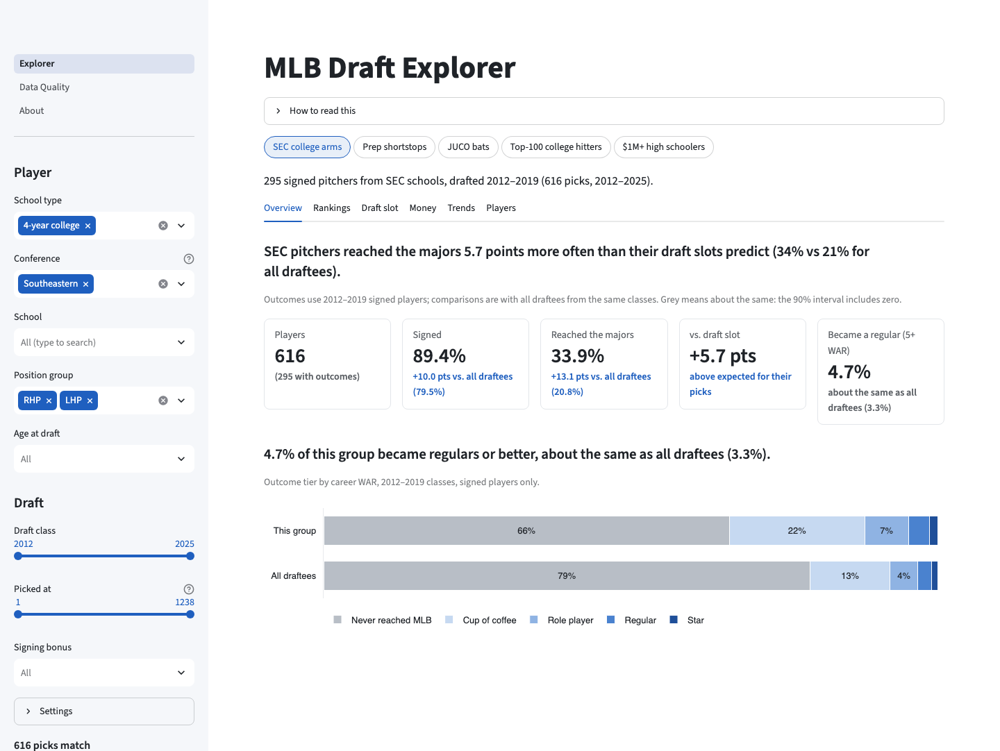
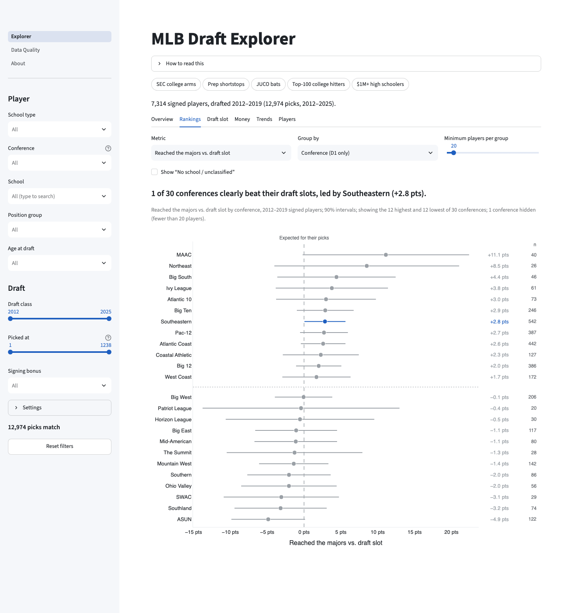
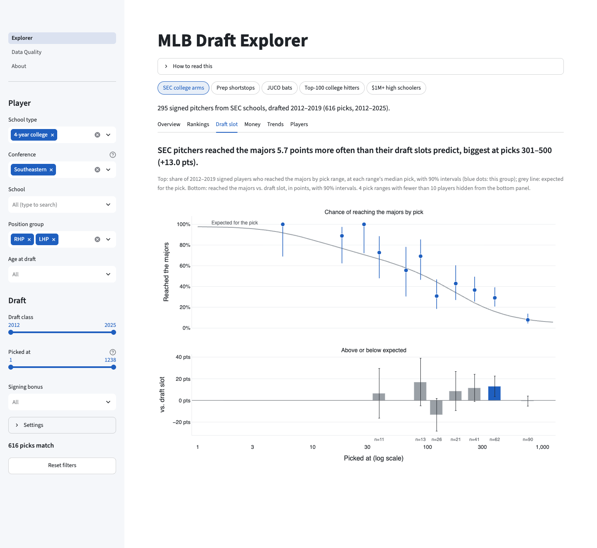
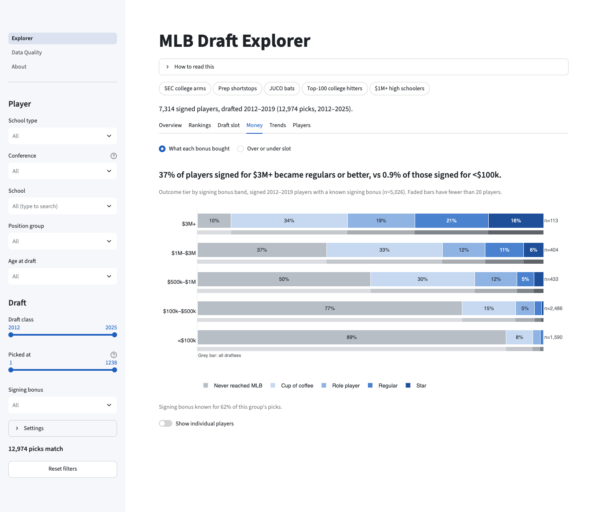
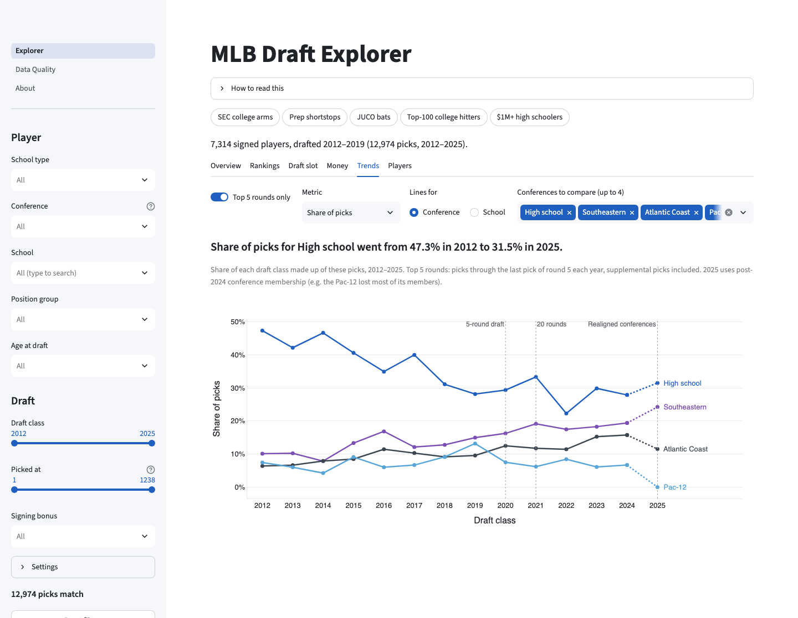
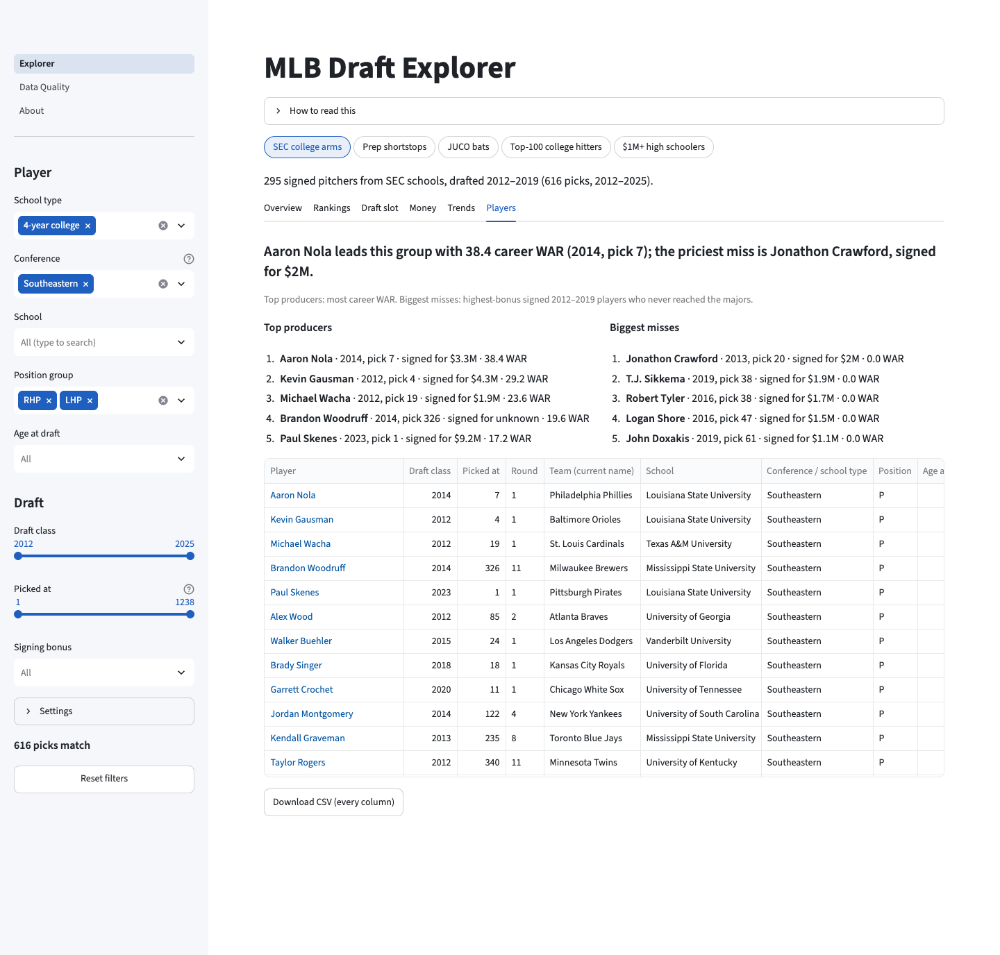
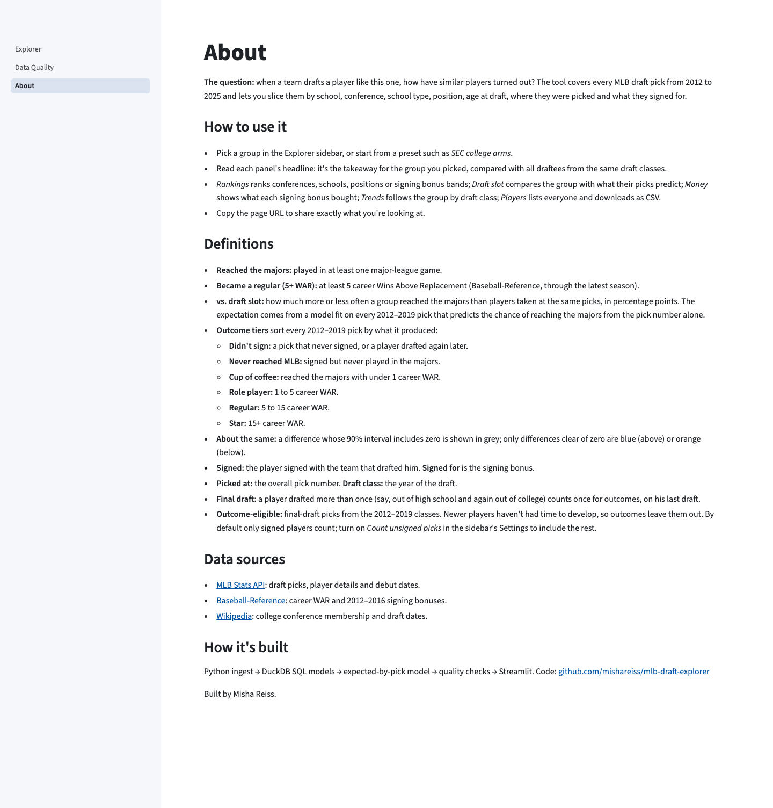
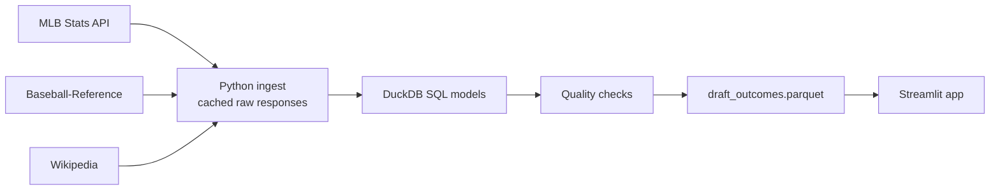

# MLB Draft Explorer

How have MLB draftees like this one turned out? A dashboard over every draft pick from 2012 to
2025, sliced by school, conference, school type, position, age, draft slot and signing bonus.

**[Open the live app](STREAMLIT_URL)**

[](https://github.com/mishareiss/mlb-draft-explorer/actions/workflows/ci.yml)



## Why this exists

Scouts and draft coordinators regularly need the answer to "what's the track record of players
like this?" That answer usually lives in an analyst's notebook. This app lets them get it
themselves: pick a group, and every panel compares it with all draftees from the same years.

## Three findings

Signed, outcome-eligible players from the 2012–2019 classes. "Against draft slot" compares a
group with an expected-by-pick model: how often players taken at the same picks reached MLB
(reproduce with `uv run python scripts/readme_findings.py`):

- **Draft slot dominates.** 92.1% of top-10 overall picks reached MLB (n=76), vs 10.5% of
  picks 301 and later (n=4,951).
- **Most of the SEC's edge is draft position.** SEC draftees reached MLB at 30.8% vs 20.8% for
  all draftees, but against their draft slots they're only 2.8 points ahead (90% interval
  +0.1 to +5.6, n=542).
- **High schoolers' higher MLB rate comes from being picked earlier.** Signed high school
  draftees reached MLB more often than 4-year college players (28.2% vs 19.8%), but against
  their draft slots they're 3.9 points behind (90% interval −5.7 to −2.1, n=1,281), while
  college players are 1.0 point ahead (+0.2 to +1.8, n=5,264).

## What you can do in the app

- **Pick a group** in the sidebar (school type, conference, school, position, age, draft
  class, pick range, signing bonus) or start from a preset such as *SEC college arms*. The
  URL carries every filter, so a view can be shared as a link.
- **Overview:** reached the majors, became a regular (5+ WAR), signed and vs. draft slot,
  each against all draftees from the same classes, plus the group's outcome tier mix.
- **Rankings:** rank conferences, schools, positions, ages, rounds or signing bonus bands on
  vs. draft slot, rates or median signing bonus, with 90% intervals and a minimum sample.
- **Draft slot:** the group's chance of reaching the majors by pick against the
  expected-by-pick curve, and where it beats or trails its slots.
- **Money:** what each signing bonus band bought in outcome tiers, and over- vs under-slot
  signings for 2017–2019.
- **Trends:** share of picks, median signing bonus, reached the majors and vs. draft slot by
  draft class, top 5 rounds or all rounds, with the 2020 and 2021 rule changes marked.
- **Players:** top producers, biggest misses and every matching player, linked to MLB.com
  and downloadable as CSV.

Every panel's heading is its takeaway, computed from the filters. Blue is above, orange
below, and grey means about the same: the 90% interval includes zero.

| Rankings | Draft slot |
| --- | --- |
|  |  |
| **Money** | **Trends** |
|  |  |
| **Players** | **About** |
|  |  |


## How it's built



- [`ingest/`](ingest/): pulls and caches the raw sources, backfills 2012–2016 bonuses from
  Baseball-Reference, and builds the school and conference reference in `reference/`.
- [`models/`](models/): staging and intermediate SQL run in DuckDB by `transform/run.py`,
  ending in one row per pick with outcomes and outcome tiers.
- [`transform/slot_model.py`](transform/slot_model.py): expected MLB and 5+ WAR rates by pick
  (logistic regression on a spline of log pick), written to every row and to
  `slot_expectation.parquet`.
- [`quality/`](quality/): checks that run on every build and write `quality_report.json`. Any
  failure stops the build.
- [`app/`](app/): the Streamlit Explorer, Data Quality and About pages. Metrics live in
  `app/lib/metrics.py`, separate from the UI, and are unit-tested.

## Data quality

Every build runs 19 checks. The committed build has 12,974 picks, and 17 checks pass with 2
warnings (two picks with an age at draft outside 16–26, and one of ten expected-by-pick
calibration deciles outside its 90% interval).

- **Row reconciliation:** the output has exactly as many rows as the source picks, and every
  draft year from 2012 to 2025 is present with the expected number of rounds.
- **Uniqueness:** one row per pick and one final draft per player (a player drafted twice
  counts once for outcomes).
- **Join coverage:** a birth date for every pick and WAR for every player who reached MLB.
- **Signed logic:** only a player's final draft can be signed, and every MLB player signed.
- **Model:** every pick has an expected rate in [0, 1], the expected-by-pick curves never rise
  with pick number, and every 2012–2019 pick has exactly one outcome tier.

Baseball-Reference supplies the 2012–2016 bonuses. For 2017, where both Baseball-Reference and
MLB list bonuses, they match exactly for 99.8% of 449 picks. See
[docs/DATA_PROFILE.md](docs/DATA_PROFILE.md) for the raw-data profile.

## Limitations

- **Conferences** use the spring-2024 alignment for every draft from 2012 to 2024 (2025 uses
  the spring-2025 alignment). Realignment before 2024 isn't modeled.
- **Division** (D1 and so on) reflects a school's current membership, not its membership in the
  draft year.
- **Bonuses after round 10** are sparse for 2012–2016 (from Baseball-Reference) and for
  2018–2019 (MLB lists $0 placeholders there, which are treated as missing).
- **Outcome tiers** use career WAR to date, so the 2018–2019 classes have had less time to
  reach Regular (5+ WAR) or Star (15+ WAR) than older classes.
- **"Unsigned"** in the late rounds of 2018–2019 really means unsigned or unknown.
- **Position** is the player's current listed position, which may differ from his position at
  the draft.
- **Team** shows the franchise's current name (a 2012 Indians pick is listed under the
  Cleveland Guardians).
- **"Other 4-year"** mixes D2, D3 and NAIA schools with a few D1 schools the lookup didn't
  match.

## Run it locally

Requires [uv](https://docs.astral.sh/uv/) (it installs Python 3.12 if needed).

```sh
uv sync
make app                  # runs from the committed data at http://localhost:8501
make test lint            # offline tests and ruff
```

To rebuild from the sources:

```sh
make all-data && make build
```

The first run takes about 30 minutes because Baseball-Reference pages are fetched at most one
every 7 seconds. Raw responses are cached under `data/raw/`, so later runs make no network calls.

## Data sources and credit

- [MLB Stats API](https://statsapi.mlb.com): draft picks, player details and debut dates.
- [Baseball-Reference](https://www.baseball-reference.com): career WAR (via `pybaseball`) and
  2012–2016 signing bonuses. Data courtesy of Baseball-Reference / Sports Reference LLC.
- [Wikipedia](https://en.wikipedia.org/wiki/List_of_NCAA_Division_I_baseball_programs):
  Division I conference membership (CC BY-SA 4.0) and draft dates.

Built by Misha Reiss.
